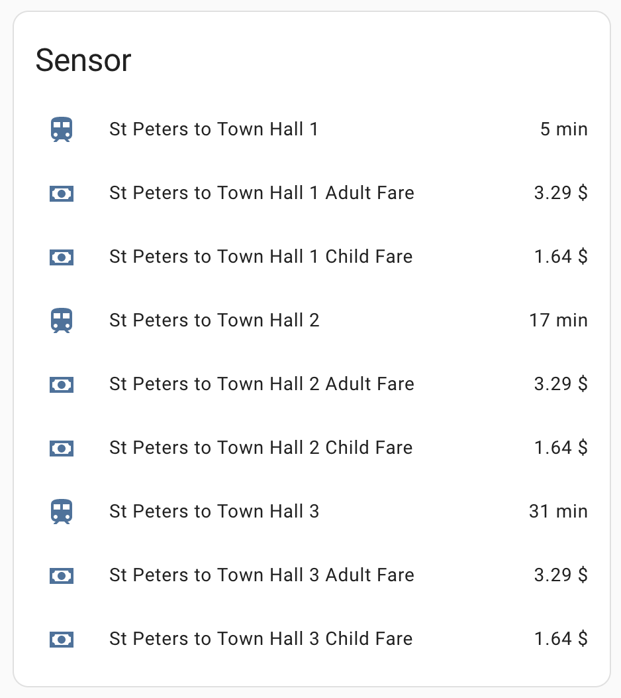

# transportnsw

An alternative to the [built-in component](https://www.home-assistant.io/integrations/transport_nsw/) and [custom component by Andy Stewart](https://github.com/andystewart999/TransportNSW) components.

This alternative is a complete re-write from the ground up without an intermediary data-model abstraction. The client is purely concerned with making API requests and not remodelling the returned data, giving the Home Assistant component/sensor full control over how the data is transformed into user facing sensors.

Additionally, the underlying API client supports requesting multiple journeys for a given trip. This allows the component to create `n` sensors for upcoming journeys with only a single API request per trip.

## Example Configuration

```yaml
transportnsw:
  api_key: !secret TNSW_API_KEY
  trips:
    - name: "Town Hall to Central"
      stop_id: "200070"
      destination_stop_id: "200060"
      num_journeys: 3

    - name: "St Peters to Town Hall"
      stop_id: "204410"
      destination_stop_id: "200070"
      num_journeys: 3
      fare_type: 'CHILD'
      modes_of_transport:
        - train
```

## Demo


